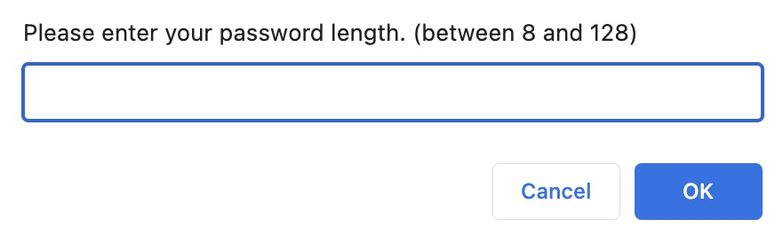
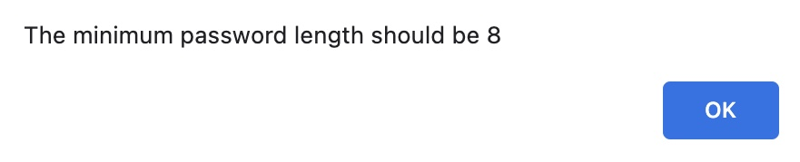
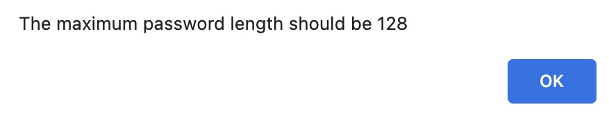
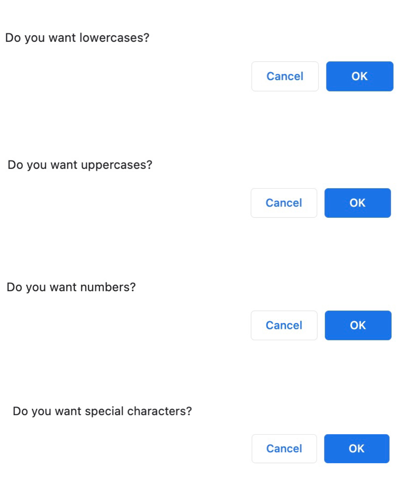
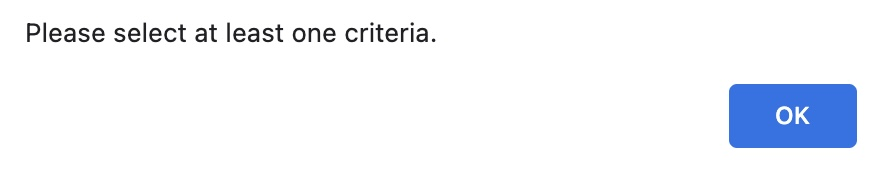
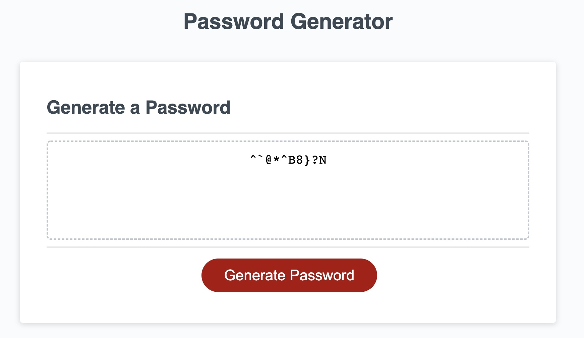

# Password-Generator

## This is the repository for the password generator

### Steps:

1. The user can click the "generate password" button
   

2. A prompt for the user to enter password length
   

3. An alert the for user if he/she entered a number which is less than 8
   

4. An alert the for user if he/she entered a number which is more than 128
   

5. 4 Criterias for the user to choose to include in the password
   

6. The user must choose at least 1 of the 4 criterias
   

7. The password is generated on the page
   

### Link:

Click [https://angelawong3.github.io/password-generator/](https://angelawong3.github.io/password-generator/) to go to the page.

---

© Angela Wong
